# A Log-Structured Merge Relaxed Radix Balanced Vector

This library provides a log-structured, snapshot-based concurrent vector that combines thread-local write buffering, background log replay, and immutable [relaxed radix balanced vector](https://infoscience.epfl.ch/server/api/core/bitstreams/7c8b929f-1f68-4948-8ea8-e364e4899b2a/content) (RRBVector) snapshots to provide high-throughput writes and lock-free consistent reads. It uses generation-tracked snapshot publication and safe reclamation of retired versions, allowing readers and writers to operate concurrently without contending on the underlying vector structure.

> [!NOTE]
> The internals of this library heavily utilize the [idris2-ref1](https://github.com/stefan-hoeck/idris2-ref1), [idris2-elin](https://github.com/stefan-hoeck/idris2-elin), and [idris2-async](github.com/stefan-hoeck/idris2-async) libraries, so you may want to familiarize yourself with them first.

## What's a relaxed radix balanced vector?

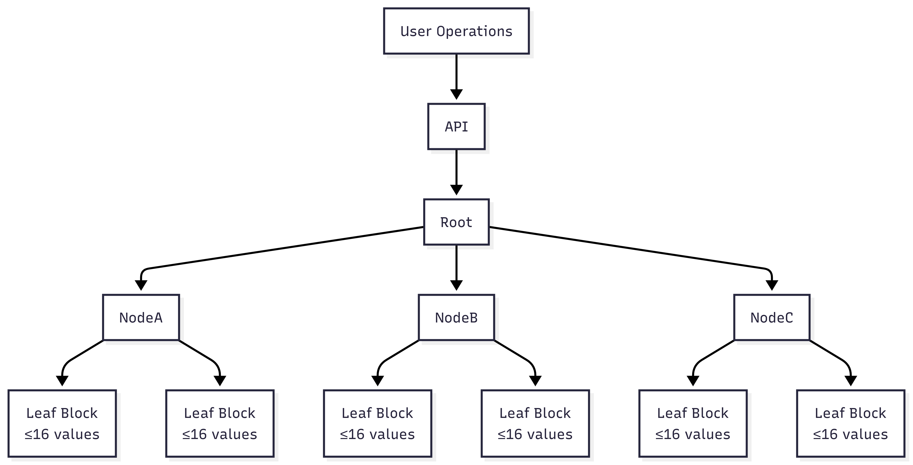

Before diving into the over-arching log-structured merge relaxed radix balanced vector (`LSMRRBVector`), it's important to understand the underlying **data model** because every complexity claim comes directly from how the tree is organized.

### Summary

A Relaxed Radix Balanced Vector (RRBVector) is a persistent, immutable vector data structure that stores elements in a shallow wide tree (typically branching by 16 or 32) to provide efficient random access, updates, appends, concatenation, and slicing while structurally sharing most of its memory between versions.

People use RRBVectors because they combine many of the performance characteristics of arrays with the safety and persistence of immutable data structures, making them particularly well-suited for functional programming, concurrent systems, and applications that frequently create modified versions of large collections without copying the entire structure.

| Operation | Complexity |
| --------- | ---------- |
| lookup    | O(log₁₆ n) |
| update    | O(log₁₆ n) |
| append    | O(log₁₆ n) |
| prepend   | O(log₁₆ n) |
| concat    | O(log₁₆ n) |
| split     | O(log₁₆ n) |
| take      | O(log₁₆ n) |
| drop      | O(log₁₆ n) |

### Breaking down relaxed radix balanced

RRB = Relaxed Radix Balanced

Which means:

- Radix → Constant branching factor.
- Balanced → Tree height remains logarithmic.
- Relaxed → Unlike a strict radix trie, subtrees are allowed to have different sizes.

That relaxation is what enables efficient concatenation.

### Top-level Structure

```idris
data Tree a
  = Balanced (Array (Tree a))
  | Unbalanced (Array (Tree a)) (Array Nat)
  | Leaf (Array a)
```

```idris
data RRBVector a
  = Empty
  | Root Nat Shift (Tree a)
```

### Meaning of Shift

Shift indicates tree depth.

### Tree Nodes

There are three tree variants:

- `Balanced`
- `Unbalanced`
- `Leaf`

#### Balanced nodes

Balanced nodes contain children.

```text
Balanced (Array (Tree a))
```

Every child is assumed to represent the same capacity.

Example:

```text
Balanced
├─ Leaf[0..15]
├─ Leaf[16..31]
├─ Leaf[32..47]
└─ Leaf[48..63]
```

#### Unbalanced nodes

This is the key RRB innovation.

```text
Unbalanced (Array (Tree a)) (Array Nat)
```

The second array stores cumulative subtree sizes.

Example:

```text
Children:
A size 8
B size 12
C size 11
```

Size table:

```text
[8,20,31]
```

Meaning:

```
0-7    -> child A
8-19   -> child B
20-30  -> child C
```

##### Why Unbalanced nodes exist

Without them:

```
A = 1,000,000 elements
B = 5 elements
```

Concatenation would require rebuilding the entire tree.

RRB instead creates:

```
Root
├─ A
└─ B
```

and stores cumulative sizes.

Thus, `lookup` can still find elements efficiently.

#### Leaf nodes

Leaves contain actual elements.

### Capacity growth

Each level multiplies capacity by 16.

| Level | Capacity/Elements |
| ----- | ----------------- |
| 1     | 16                |
| 2     | 256               |
| 3     | 4096              |
| 4     | 65536             |

### Structural Sharing

Updates never mutate.

Take `update 500 x` for example, only nodes along one path are copied.

### Why Concatenation Works

The crucial idea is that a strict radix tree demands every subtree perfectly aligned.  RRB relaxes this, this after `left >< right` ,the result may contain:

```text
Root
├─ perfectly full subtree
├─ partially full subtree
├─ tiny subtree
└─ huge subtree
```

## LSMRRBVector

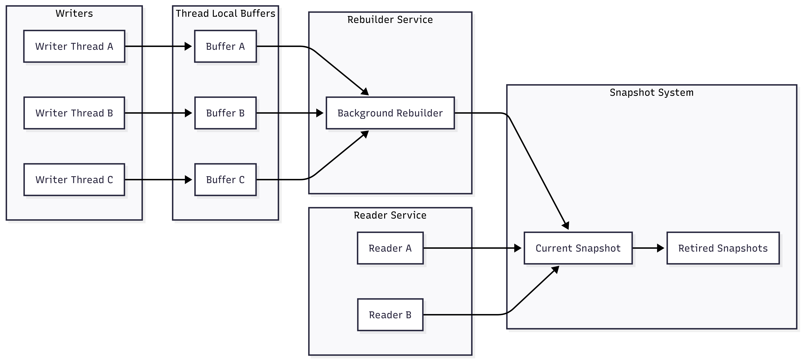

The `LSMRRBVector` is a **log-structured, immutable, concurrent vector** built on top of an underlying `RRBVector`. Rather than applying mutations directly to the vector, writers append mutation records into per-thread logs. A background rebuilder process periodically merges those logs into a new immutable RRB snapshot and atomically publishes it for readers.

This design separates the system into four major subsystems:

1. Writers
2. Thread-local mutation buffers
3. Snapshot publication/Rebuild pipeline
4. Readers and reclamation

### Internal state layout

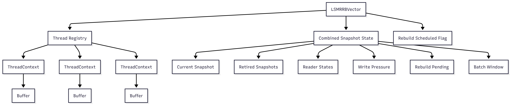

### Writers

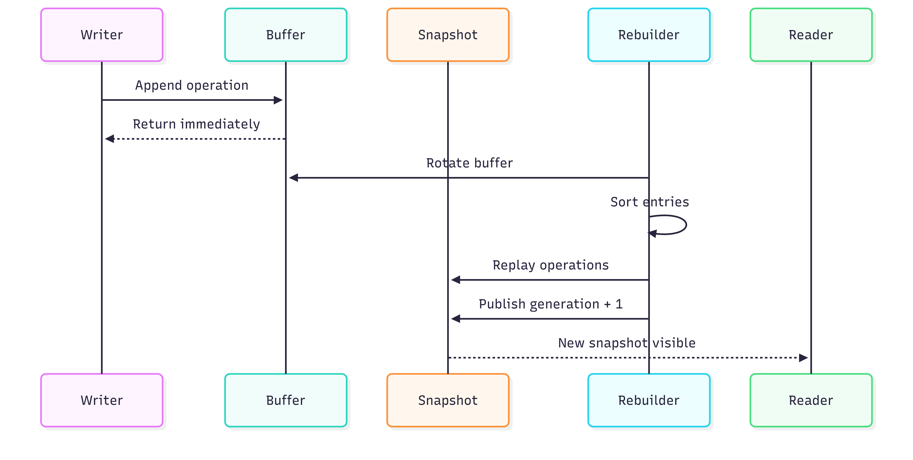

The write path is intentionally designed to avoid touching the published snapshot.

When a thread performs one of the following possible operations:

- `append`
- `prepend`
- `insert`
- `delete`
- `update`

The operation is converted into an `Operation` value and wrapped in an `Entry`.

The write never modifies the current `RRBVector`.  Instead, it is appended into a thread-owned mutation log.

This provides several important properties:

- O(1) writes
  - Appending into a `SnocList` buffer is amortized O(1).
- No snapshot contention
  - Writers never contend on the immutable snapshot.
- No global vector mutation
  - The current snapshot remains completely immutable.
- Batch-friendly
  - Thousands of writes can accumulate before rebuild.

#### Thread-local mutation buffers

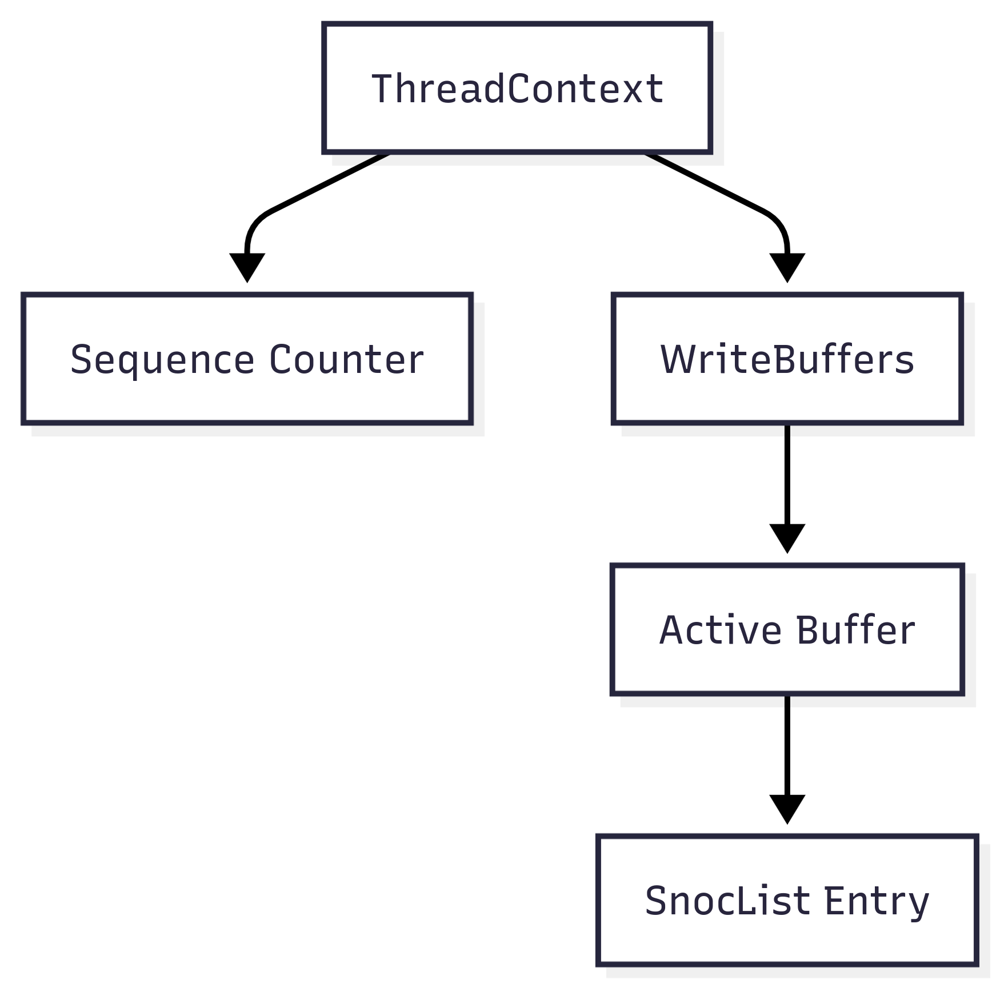

Every participating thread owns a `ThreadContext a`.

```idris
record ThreadContext a where  
  constructor MkThreadContext  
  threadid : Int  
  sequence : Nat  
  buffers  : WriteBuffers a
```

The sequence counter provides deterministic ordering among operations originating from the same thread.

For example:

| Sequence | Operation |
| -------- | --------- |
| 0        | Append a  |
| 1        | Append b  |
| 2        | Delete 0  |

Even if timestamps are identical, replay order remains deterministic.

##### Why per-thread buffers?

A single global mutation log would become a hotspot.

Instead:

```text
Thread A -> Buffer A
Thread B -> Buffer B
Thread C -> Buffer C
```

Each thread appends independently.

The rebuild process later merges all buffers together.

This is conceptually similar to:

- LSM-tree memtables.
- Per-core logging systems.
- Lock-free batching queues.

#### Write pressure and adaptive batching

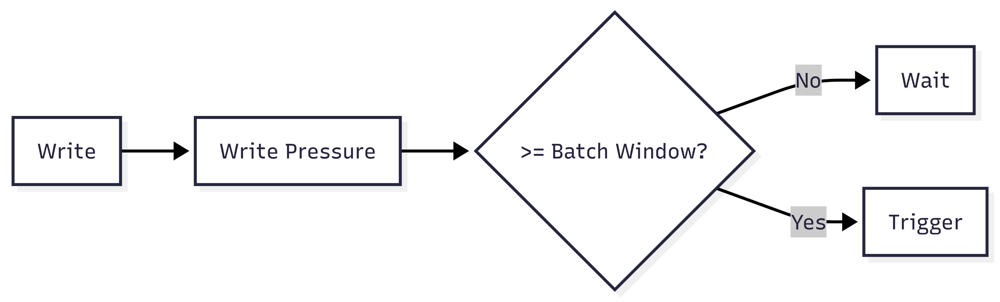

State lives inside `CombinedSnapshotState`, that has the fields `writepressure`, `rebuildpending`, `batchwindow`, and every write increments global write pressure.

Example:

Given batchwindow = 64, after 64 writes, the system would mark rebuildpending = True, and schedules rebuild work.

##### Adaptive growth

Given a heavy Heavy write load of window = 64 and pressure = 200, window becomes 128, thus the system rebuilds less frequently.

##### Adaptive shrink

Given a light write load of window = 128 and pressure = 10, window becomes 64, thus the system rebuilds more aggressively.

###### Summary

The adaptive growth/shrink mechanisms allows the vector to automatically balance latency, rebuild cost, and throughput, and system doesn't require manual tuning.

### Snapshot publication/Rebuild pipeline

Scheduling is deliberately separate from rebuilding.

The `rebuildscheduled` flag prevents duplicate scheduling.

Without this guard 100 writers might produce 100 rebuild requests.

Instead, the first writer schedules the rebuild, while later writers observe already scheduled, which creates natural request coalescing.

#### Buffer rotation

Rotation is the critical ownership-transfer step.

Before rotation:


After rotation:

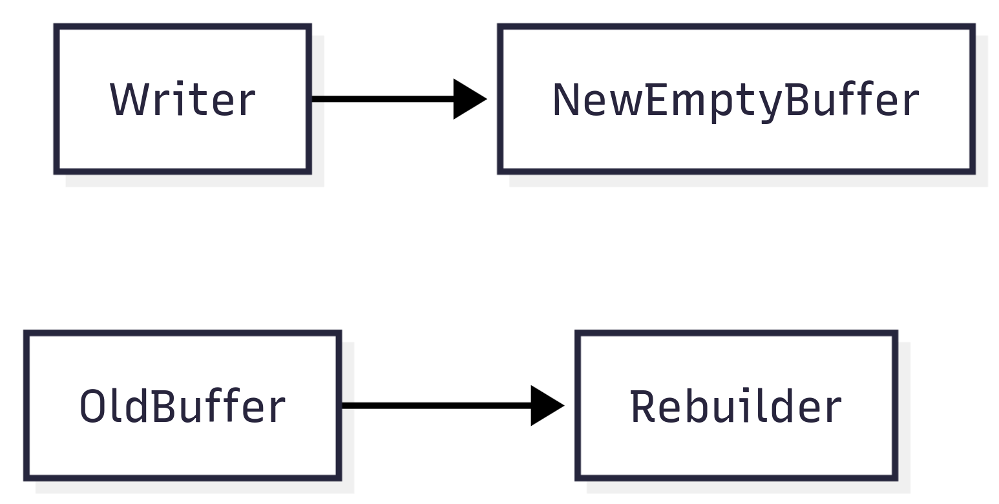

The rebuilder obtains exclusive ownership of the old buffer.

Writers immediately continue using a fresh buffer, which avoid global pauses, writer blocking, and rebuild contention.

#### Entry collection

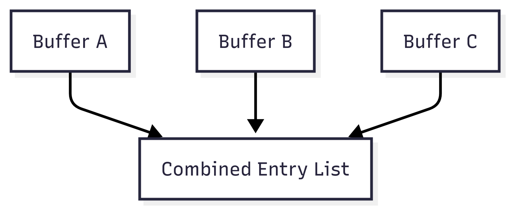

After rotation the rebuilder owns many buffers, and collection flattens them into one list.  At this stage ordering is not yet globally deterministic.

#### Deterministic sorting

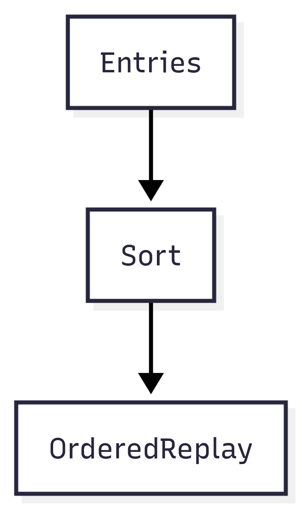

The collected entries are sorted by:

1. timestamp
2. thread id
3. sequence

This produces a globally stable replay order.

Example:

```
T1 Seq0
T2 Seq0
T1 Seq1
T2 Seq1
```

Even under extreme concurrency, replay results remain deterministic.

This is critical because immutable snapshots must be reproducible.

#### Replay into an RRBVector

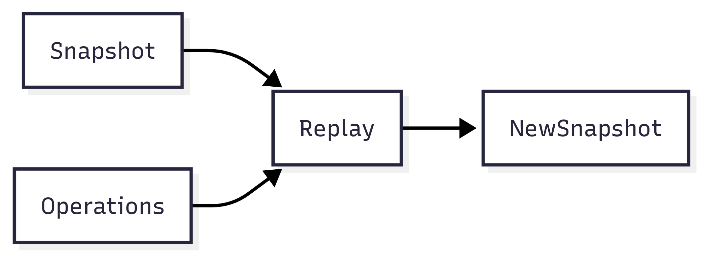

After sorting, operations are replayed.

The rebuild stage is effectively acting as a log replayer, which is where the log-structure merge (LSM) part of `LSMRRBVector` becomes most visible.

#### Snapshot publication

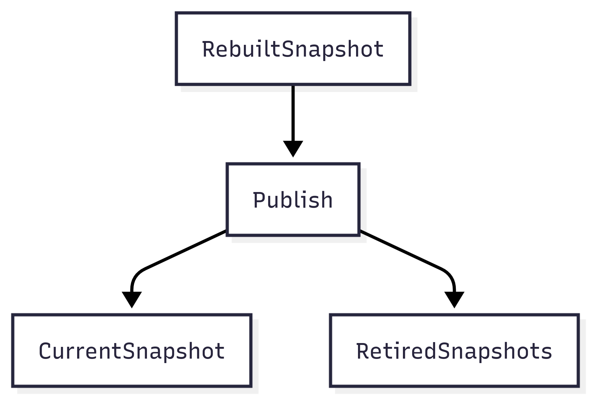

Publication is atomic.

Internally, `old snapshot` becomes `retired snapshot`, while `new snapshot` becomes `current snapshot`.

Generation increases, for example `42 -> 43`, and readers always observe `snapshot and generation` as a consistent pair.

They can never see `new snapshot and old generation` or `old snapshot and new generation` because publication replaces the entire `SnapshotState` atomically.

#### Reader tracking

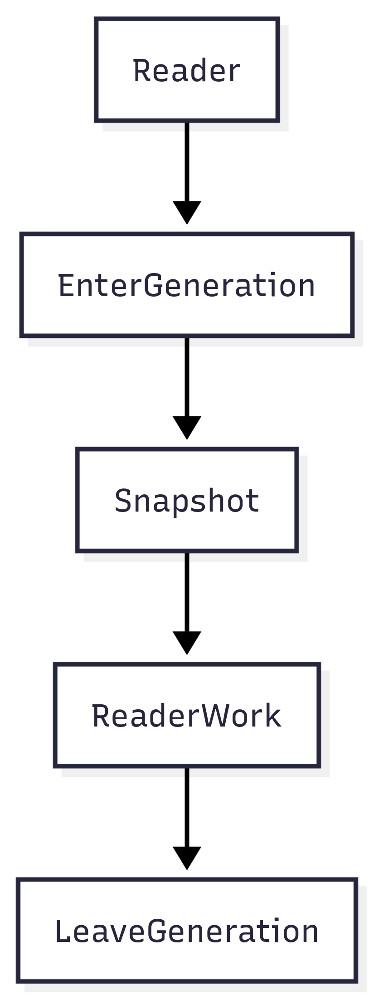

Readers participate in generation tracking, since each active reader records the generation within the `ReaderState`.

This tells reclamation exactly which snapshots might still be visible.

#### Retired snapshots

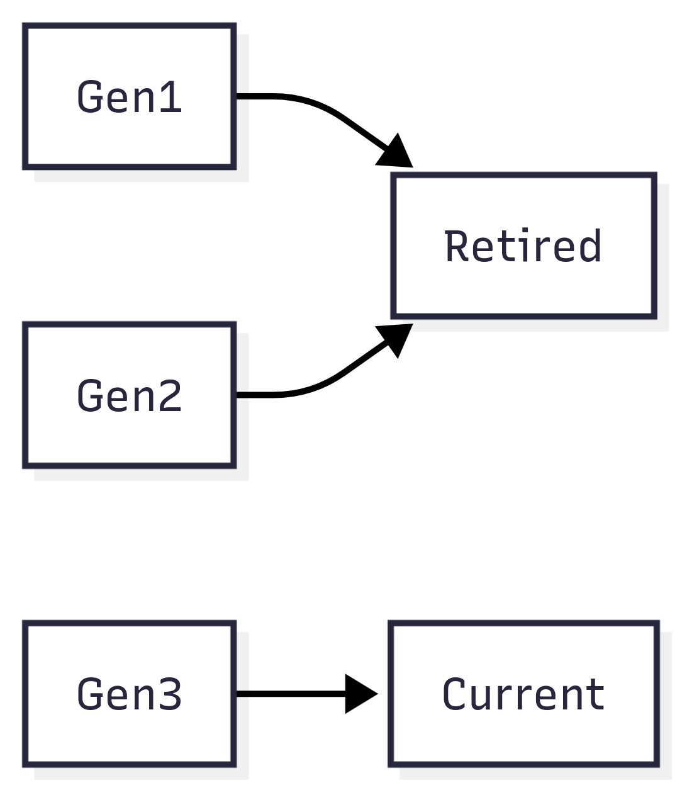

Every publication retires the previous snapshot.

Retired snapshots exist because readers may still hold references to older generations, thus retirement ensure readers are allowed to "lag" the most recent publication.

#### Generation-based reclamation

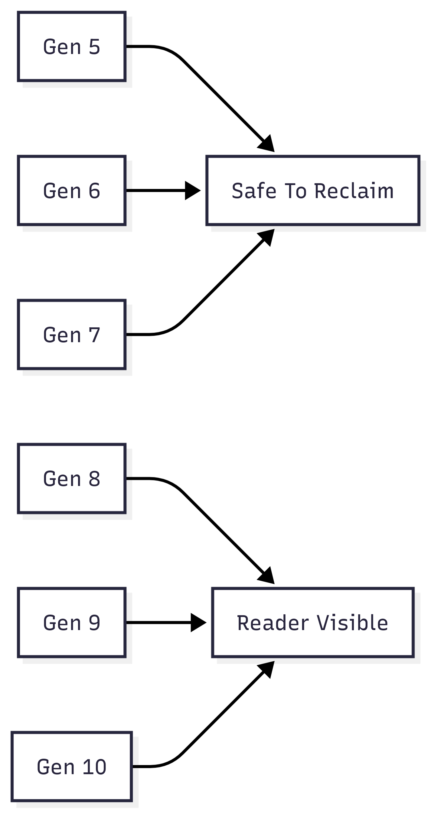

Reclamation uses the oldest active reader generation.

Example:

| Reader | Generation |
| ------ | ----------- |
| 1      | 15          |
| 2      | 18          |
| 3      | 20          |

Retired snapshots (generations): `10 - 16`

Reader `1` is reading the oldest generation, `15`.

Thus, generations `10 - 14` can be safely reclaimed.

### Readers

Readers never block the rebuilder service, they read the from one of the not-yet reclaimed immutable RRB snapshots instead.

#### Reader architecture

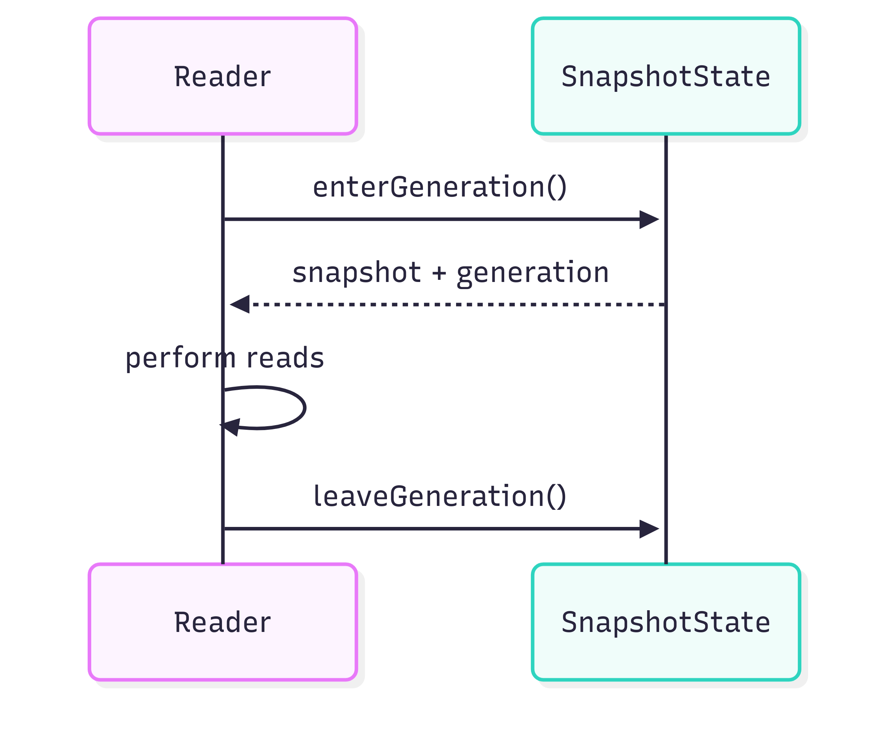
